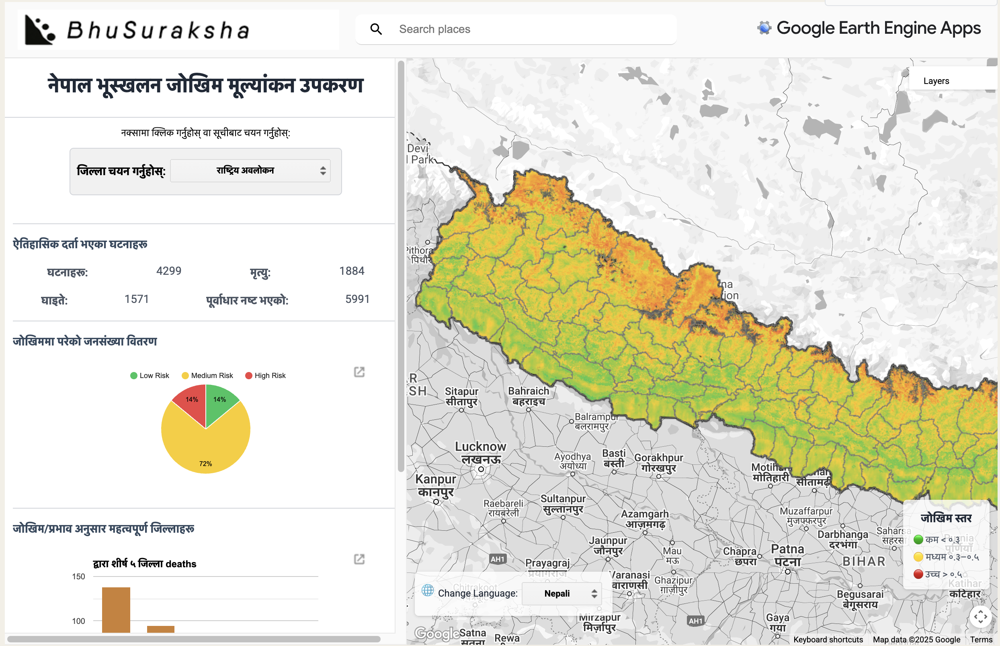

# NEPAL LANDSLIDES RISK APPLICATION  
**Big Data Solutions for Himalayan Hazards**  

  

---

### Context  
| Category | Details |
|----------|---------|
| **University** | University College London (UCL) |
| **Department** | Centre for Advanced Spatial Analysis (CASA) |
| **Year** | 2024-2025 |
| **Program** | MSc Urban Spatial Science |
| **Module** | [CASA0025 Building Spatial Applications with Big Data](https://www.ucl.ac.uk/module-catalogue/modules/building-spatial-applications-with-big-data-CASA0025) |
| **Module Lead** | Ollie Ballinger |
| **Credits** | 15 |
| **Assessment** | Group Project (70% of module) |
| **Team** | RASTERNAUTS: Aadarsh Ajikumar, Norah Al Hosain, Dan Jung Jihun, Maheer Khan, Clare Rickard, Robb Young |

---

### Project Overview  
This Google Earth Engine application assesses landslide risks across Nepal's challenging terrain, combining satellite data, susceptibility modeling, and population exposure analysis. Our web tool delivers district-level risk assessments with multilingual support, helping disaster planners prioritize mitigation efforts in vulnerable Himalayan communities.

**Live Application:** [Explore the Tool](https://maheer-maps.github.io/CASA25_Rasternauts/)  

---

### © License  
This project is licensed under the [MIT License](LICENSE).
